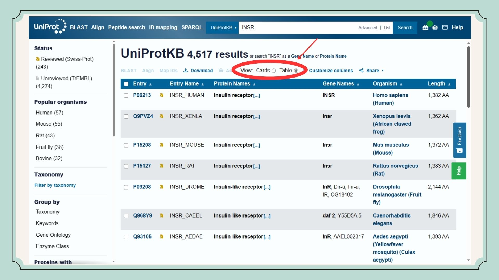
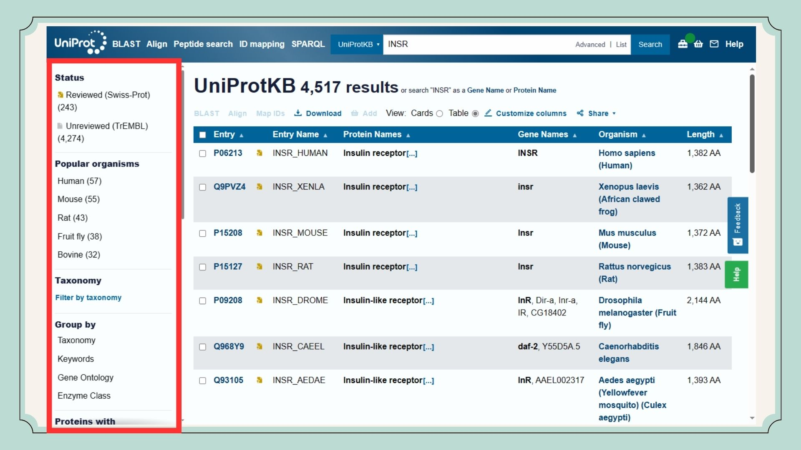

<h1 align="center">Seminário - Banco de Dados de Sequências de Proteínas  
  
  
</h1>

# Apresentado por:
- [João Victor Assaoka](https://github.com/Assaoka)
- Júlia Katsurayama
- Victor Oliveira

# Slides:

